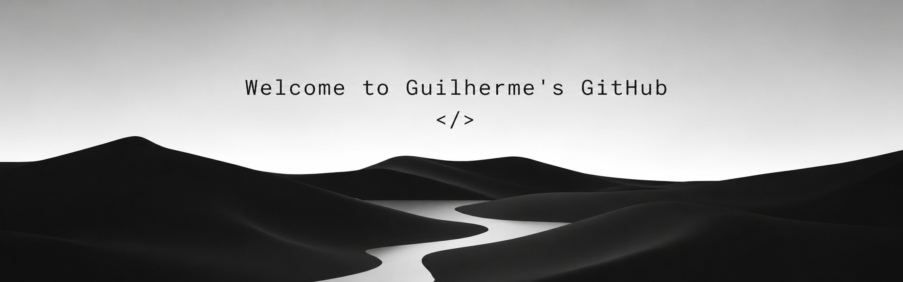

  

---

## About Me

- Information Systems student
- Focused on Full Stack Development
- Building practical projects to improve architecture and problem-solving
- Interested in modern UI, performance and scalable applications

---

## Technologies

---

## Currently Learning

- React & Next.js
- Java OOP
- PostgreSQL
- Backend Architecture
- Git & GitHub Workflow

---

## GitHub Statistics

  
  

---

## Contribution Streak

---

## Main Goals

- Build real-world projects
- Strengthen full stack skills
- Improve clean code and architecture
- Create scalable and functional applications

---

## Contact

- Portfolio: https://guiisantozs.github.io/portfolio/
- Email: guiisantozs@gmail.com
- LinkedIn: https://www.linkedin.com/in/gui-santos-5489052b6/
